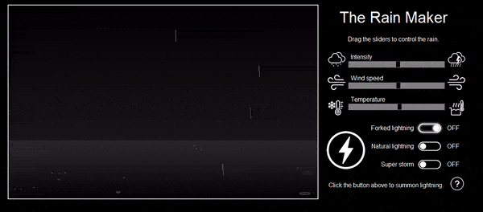

# rainmaker
Procedurally generated rain, snow and lightning.

## General info
This program allows the user to simulate a thunderstorm. By dragging the sliders, you can control the intensity of the rain, the wind direction and summon bolts of lightning from the sky. 
	
## Setup
Download `The Rain Maker.exe`.

## Notes
The algorithm to generate lightning in this program causes lag and can be optimized.

Click <a href="https://github.com/ChaseLean/procedural-lightning">here</a> for an improved version of the algorithm.
